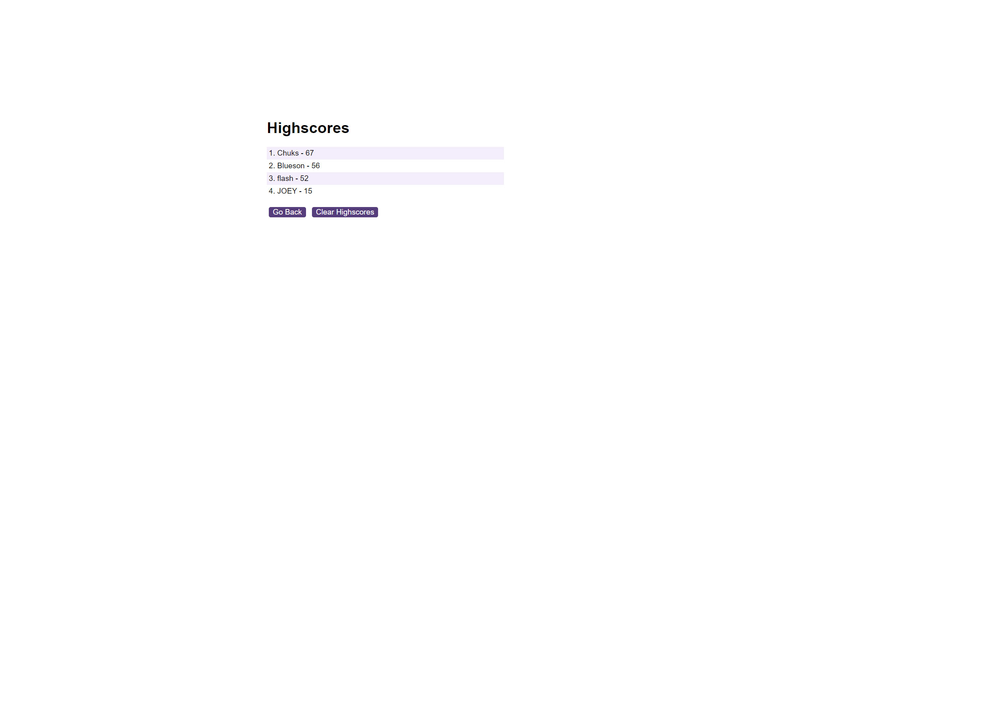

# Coding Quiz App

## Description
The Coding Quiz App is a fun and interactive way to test your knowledge of programming concepts and syntax. With a time limit for each question and penalties for incorrect answers, it challenges users to think quickly and accurately. The app features multiple-choice questions covering various topics in programming, providing both entertainment and educational value.

## Features
- Multiple-choice questions covering common programming concepts.
- Timer functionality to add pressure and excitement.
- Penalties for incorrect answers, enhancing the challenge.
- Highscores tracking to encourage friendly competition.

## Usage
1. Click the "Start Quiz" button to begin the quiz.
2. Read each question carefully and select the correct answer from the choices provided.
3. If your answer is correct, you'll move on to the next question. If incorrect, time will be deducted from the timer.
4. After answering all questions or when the timer runs out, the quiz will end.
5. Enter your initials to save your score and see how you rank among other players.

## Technologies Used
- HTML
- CSS
- JavaScript

## Deployment
The Coding Quiz App is deployed and can be accessed [here](https://yourDeployedQuizAppUrl.com). Try it out and test your coding knowledge!

## Screenshot
  
  
  

## Credits
This Quiz App was created by [Chukwuka Nkadi](https://yourGithubAccountUrl.com).

## License
This project is licensed under the [MIT License](https://opensource.org/licenses/MIT).
